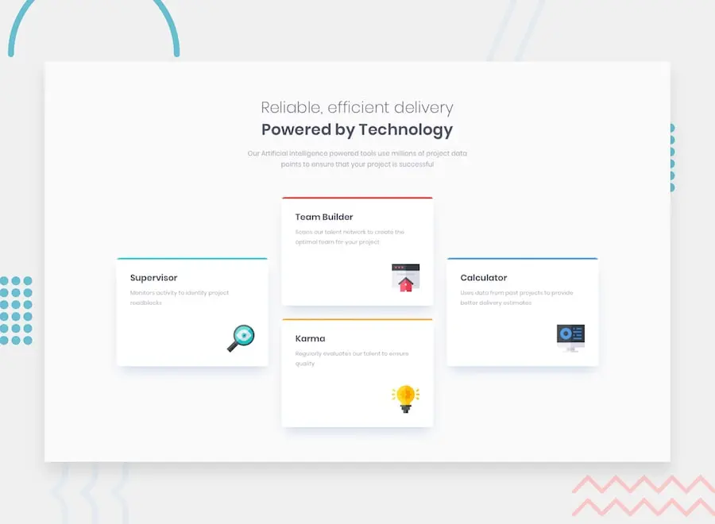

Responsive four card feature section using CSS Grid

## Links
- Live Site: <a href="https://janikjczcz.github.io/four-card-feature-section/" target="_blank" aria-label="Open Four card feature section live site in new tab">https://janikjczcz.github.io/four-card-feature-section/</a>
- Repository: <a href="https://github.com/janikjczcz/four-card-feature-section" target="_blank" aria-label="Open Four card feature section github repository in new tab">https://github.com/janikjczcz/four-card-feature-section</a>
