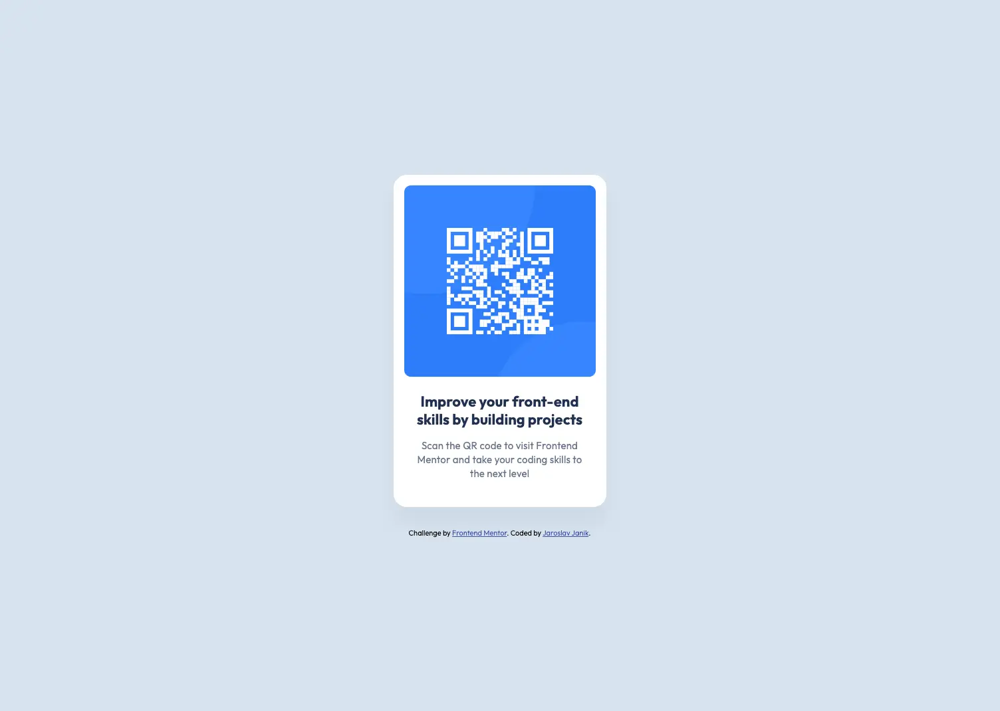

Simple QR Code component, this was my first Frontend Mentor project

## Links
- Live Site: <a href="https://janikjczcz.github.io/qr-code-component/" target="_blank" aria-label="Open QR code component live site in new tab">https://janikjczcz.github.io/qr-code-component/</a>
- Repository: <a href="https://github.com/janikjczcz/qr-code-component" target="_blank" aria-label="Open QR code component github repository in new tab">https://github.com/janikjczcz/qr-code-component</a>
