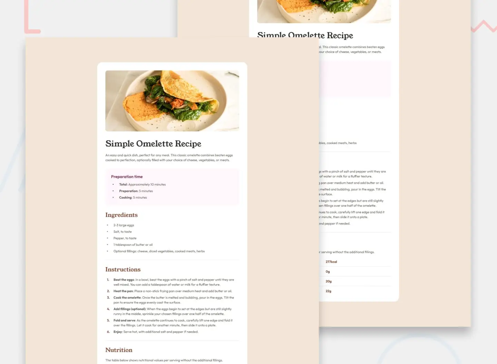

&nbsp;

## Links
- Live Site: <a href="https://janikjczcz.github.io/recipe-page/" target="_blank" aria-label="Open Recipe page live site in new tab">https://janikjczcz.github.io/recipe-page/</a>
- Repository: <a href="https://github.com/janikjczcz/recipe-page" target="_blank" aria-label="Open Recipe page github repository in new tab">https://github.com/janikjczcz/recipe-page</a>
