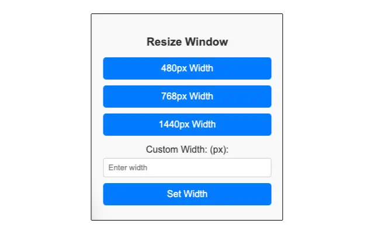

Resize Window is a Chrome extension for changing window width

**Main Features**
- Quickly resize window to 480px, 768px, and 1440px
- Resize window to custom width
- Height stays the same as your current window height
- Available in English and Czech language

## Links
- Chrome Web Store: <a href="https://chromewebstore.google.com/detail/resize-window-%E2%80%93-quick-eas/fgngflnmokojmmfgkiheohpfladpancd" target="_blank" aria-label="Open Resize Window chrome web store page in new tab">Resize Window – Quick & Easy Window Resizing</a>
- Repository: <a href="https://github.com/janikjczcz/resize-width-ext" target="_blank" aria-label="Open Resize Window github repository in new tab">https://github.com/janikjczcz/resize-width-ext</a>
