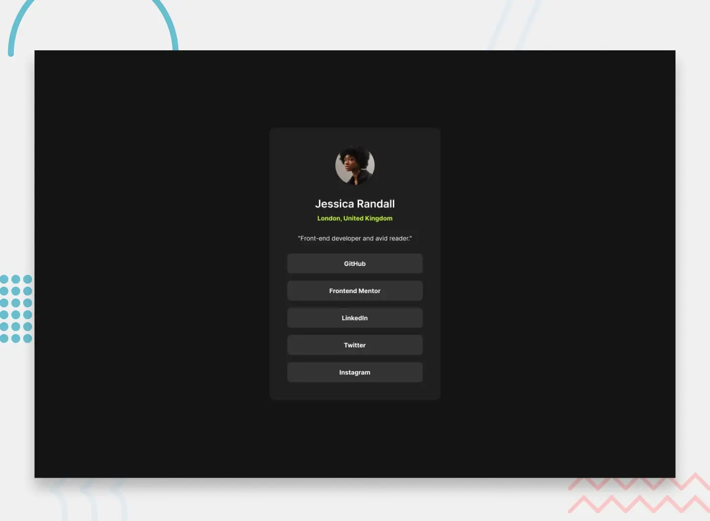

Social links profile component. Tried to use native CSS nesting.

## Links
- Live Site: <a href="https://janikjczcz.github.io/social-links-profile/" target="_blank" aria-label="Open Social links profile component live site in new tab">https://janikjczcz.github.io/social-links-profile/</a>
- Repository: <a href="https://github.com/janikjczcz/social-links-profile" target="_blank" aria-label="Open Social links profile component github repository in new tab">https://github.com/janikjczcz/social-links-profile</a>
